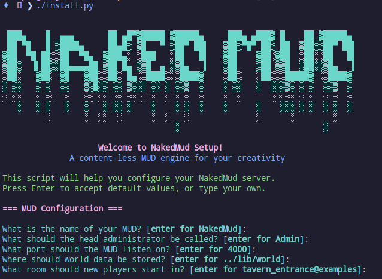
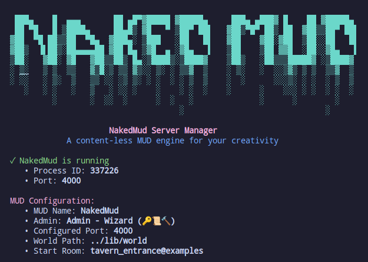
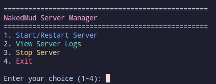

# NakedMud 4.1 - Compilation and Running Guide
**Maintainer**: LimpingNinja (Kevin Morgan)

Welcome to NakedMud! This guide will help you get up and running with your own MUD server. Don't worry if you're new to compiling C code - we'll walk through everything step by step.

## Table of Contents
- [What You'll Need](#what-youll-need)
- [Getting Dependencies](#getting-dependencies)
- [Building Your MUD](#building-your-mud)
- [Setting Things Up](#setting-things-up)
  - [Quick Configuration with install.py](#quick-configuration-with-installpy-recommended)
  - [Manual Configuration](#understanding-the-muddata-file-manual-configuration)
- [NakedMud Server Manager](#nakedmud-server-manager-recommended)
  - [Features](#server-manager-features)
  - [Using the Server Manager](#using-the-server-manager)
- [Running Your Server](#running-your-server)
- [Your First Login](#your-first-login)
- [When Things Go Wrong](#when-things-go-wrong)

## What You'll Need

Before we dive in, let's make sure you have everything ready:

- **Operating System**: Linux or macOS (sorry Windows folks, but WSL works great!)
- **Python**: Version 3.12.11 (we'll show you how to get this easily with pyenv)
- **C Compiler**: GCC 9+ or Clang 12+ (don't worry, we'll install this)
- **Build System**: SCons 4.5.0+ (this makes building super easy)
- **Memory**: At least 2GB RAM (your MUD will be lightweight, promise!)
- **Disk Space**: About 100MB free space (not much at all)

## Getting Dependencies

Let's get your system ready! Pick your operating system below:

### Ubuntu/Debian Users
```bash
# Update your package list (always a good idea!)
sudo apt-get update

# Install all the goodies we need
sudo apt-get install -y \
    build-essential \
    python3-dev \
    python3-pip \
    zlib1g-dev \
    libssl-dev

# That's it! Easy, right?
```

### Fedora/RHEL/CentOS Users
```bash
# Install development tools
sudo dnf groupinstall "Development Tools"

# Get the specific libraries we need
sudo dnf install \
    python3-devel \
    python3-pip \
    zlib-devel \
    openssl-devel
```

### macOS Users (with Homebrew)
```bash
# First, install Xcode Command Line Tools (if you haven't already)
xcode-select --install

# Install Homebrew if you don't have it yet
# (It's like a package manager for macOS - super handy!)
/bin/bash -c "$(curl -fsSL https://raw.githubusercontent.com/Homebrew/install/HEAD/install.sh)"

# Now get our dependencies
brew install python@3.12 scons openssl zlib
```

## Building Your MUD

### The Easy Way (Using pyenv - Recommended!)

Pyenv makes managing Python versions a breeze. Here's how to use it:

```bash
# Install pyenv (this might take a minute)
curl https://pyenv.run | bash

# Add pyenv to your shell (restart your terminal after this)
echo 'export PATH="$HOME/.pyenv/bin:$PATH"' >> ~/.bashrc
echo 'eval "$(pyenv init --path)"' >> ~/.bashrc
echo 'eval "$(pyenv init -)"' >> ~/.bashrc

# Restart your terminal, then:
# Install the exact Python version NakedMud loves
pyenv install 3.12.11

# Navigate to your NakedMud directory
cd /path/to/nakedmud

# Set the local Python version (this creates a .python-version file)
pyenv local 3.12.11

# Install SCons (our build system)
pip install scons

# Now for the magic moment - build your MUD!
cd src
scons

# If everything went well, you should see a shiny new 'NakedMud' executable!
```

### The Manual Way

If you prefer to do things manually (or pyenv isn't your thing):

```bash
# Make sure you're in the source directory
cd /path/to/nakedmud/src

# Build the server (fingers crossed!)
scons

# The compiled binary will appear as 'NakedMud' in this directory
```

## Setting Things Up

### Quick Configuration with install.py (Recommended)

The easiest way to configure your MUD is with our interactive installer:

```bash
# From your NakedMud root directory
./install.py
```

Just press Enter to accept defaults, or type your own values. It's that simple!



### Understanding the muddata File (Manual Configuration)

The heart of your MUD's configuration lives in `lib/muddata`. Let's peek at what's important, though all settings are needed:

```
start_room             : tavern_entrance@examples
world_path             : ../lib/world
listening_port         : 5555
screen_width           : 80
puid                   : 1
```

Here's what these mean:
- **start_room**: Where new players appear (like a spawn point in games!)
- **world_path**: Where your game world files live
- **listening_port**: The port players connect to (5555 is traditional for MUDs)
- **puid**: Player UID counter - **important**: whoever gets UID 1 becomes admin!

### Pro Tips for Configuration
- The `world_path` is relative to where you run NakedMud from
- Always run NakedMud from the `src` directory (trust us on this one)
- The first player to create an account gets admin powers automatically

## Running Your Server

### Recommended: Use the Server Manager



When you run the server manager, it immediately checks your configuration files to make sure everything is set up correctly. It'll catch common mistakes like missing world files or invalid room references before they cause problems. Once everything checks out, you'll see a status display showing whether your server is running, what port it's using, and who your administrators and staff members are. You'll see little emoji indicators (🔑 for admins, 📜 for scripters, 🔨 for builders) that make it easy to see your staff structure at a glance.

### Using the Server Manager

Getting started is as simple as running one command from your NakedMud directory:

```bash
./startmud.py

# Or specify a custom mudlib path (defaults to ../lib, relative to src/)
./startmud.py --mudlib-path /custom/mudlib
```

The server manager will validate your current muddata configuration, show you the current status, and if your server isn't already running, it'll start it up automatically. 



Once your server is running, you'll get an interactive menu that lets you restart the server (useful after making changes), view recent log entries to see what's happening, or gracefully shut down when you're done. 

The server manager is also smart about process management. It handles zombie processes, ensures clean shutdowns, and can detect if your server crashes and needs to be restarted. This means you can focus on building your world instead of wrestling with server administration.

### Alternative: Manual Startup

If you prefer to run the server directly:

```bash
# From your NakedMud root directory
cd src
./NakedMud

# Or specify a custom mudlib path (defaults to ../lib, relative to src/)
./NakedMud --mudlib-path /custom/mudlib

# You should see startup messages - exciting!
```

### Running in the Background (For Serious MUD Admins)
```bash
# Using nohup (keeps running even if you log out)
cd /path/to/nakedmud/src
nohup ./NakedMud > ../log/mud.log 2>&1 &

# Or using screen (lets you detach and reattach)
screen -S mymud
cd /path/to/nakedmud/src
./NakedMud
# Press Ctrl+A then D to detach
# Use 'screen -r mymud' to reattach later

# Or using tmux (modern alternative to screen)
tmux new-session -s mymud
cd /path/to/nakedmud/src
./NakedMud
# Press Ctrl+B then D to detach
# Use 'tmux attach -t mymud' to reattach
```

## Your First Login

Time for the fun part! Let's connect to your brand new MUD:

```bash
# Connect using telnet (old school but reliable)
telnet localhost 5555

# Or if you have a MUD client, connect to:
# Host: localhost
# Port: 5555
```

**Important**: The first account you create will automatically become the administrator! This is your chance to become the all-powerful MUD god. 😄

### What to Expect
1. You'll see a welcome screen
2. Create your first account (remember, this makes you admin!)
3. Create your first character
4. Explore the example world
5. Start building your dream MUD!

## When Things Go Wrong

Don't panic! Here are solutions to common hiccups:

### "Python.h: No such file or directory"
```bash
# You need Python development headers
# Ubuntu/Debian:
sudo apt-get install python3-dev

# Fedora/RHEL:
sudo dnf install python3-devel
```

### "bind: Address already in use"
Something else is using port 5555. Either:
- Change the `listening_port` in muddata to something else (like 5556)
- Or find what's using port 5555: `sudo netstat -tulpn | grep 5555`

### "Permission denied" when running NakedMud
```bash
# Make the binary executable
chmod +x NakedMud
```

### World Loading Issues
If rooms or areas don't load:
- Check that `world_path` in muddata points to the right place
- Make sure you're running NakedMud from the `src` directory
- Verify file permissions on your world files

### Still Stuck?
- Check the `log` directory for detailed error messages
- Look at the documentation in the `doc` directory
- The NakedMud community is friendly - don't hesitate to ask for help!

## Making It Faster (Performance Tips)

Want to squeeze out extra performance? Here are some tweaks:

### Compiler Optimizations
```bash
# Edit src/SConstruct and add optimization flags
# Look for the CCFLAGS section and add:
env.Append(CCFLAGS=['-O3', '-march=native'])

# Then rebuild
scons -c  # Clean old build
scons     # Build with optimizations
```

### System Tweaks
```bash
# Increase file descriptor limits (for lots of players)
ulimit -n 4096

# Add this to your ~/.bashrc to make it permanent
echo 'ulimit -n 4096' >> ~/.bashrc
```

### Maintenance Tasks
- Rotate log files regularly (they can get big!)
- Monitor server performance with `top` or `htop`
- Back up your world files and player data

## Final Words

Congratulations! You now have your very own MUD server running. This is just the beginning of your journey into MUD development. The real fun starts when you begin building your world, adding custom features, and watching players explore your creation.

Remember:
- Start small and build gradually
- The documentation in the `doc` directory is your friend
- The Python scripting system lets you add amazing features
- Most importantly: have fun!

Welcome to the wonderful world of MUD development. Your adventure starts now!

*Happy MUDding!*
